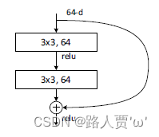
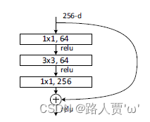

# 一、BasicBlock模块

BasicBlock是基础版本，主要用来构建ResNet18和ResNet34网络，里面只包含两个卷积层，使用了两个 3*3 的卷积，通道数都是64，卷积后接着 BN 和 ReLU。

右边的曲线就是Shortcut Connections，将输入x加到输出。

# 二、Bottleneck 模块

Bottleneck结构图如图所示：

Bottleneck主要用在ResNet50及以上的网络结构，与BasicBlock不同的是这里有 3 个卷积，分别为 1*1，3*3，1*1大小的卷积核，分别用于压缩维度、卷积处理、恢复维度。
这里的通道数是变化的，1*1卷积层的作用就是用于改变特征图的通数，使得可以和恒等映射x相叠加，另外这里的1*1卷积层改变维度的很重要的一点是可以降低网络参数量，这也是为什么更深层的网络采用BottleNeck而不是BasicBlock的原因。

注意：这里outchannel / 4是因为Bottleneck层输出通道都是输入的4倍
s://blog.csdn.net/weixin_43334693/article/details/128409032